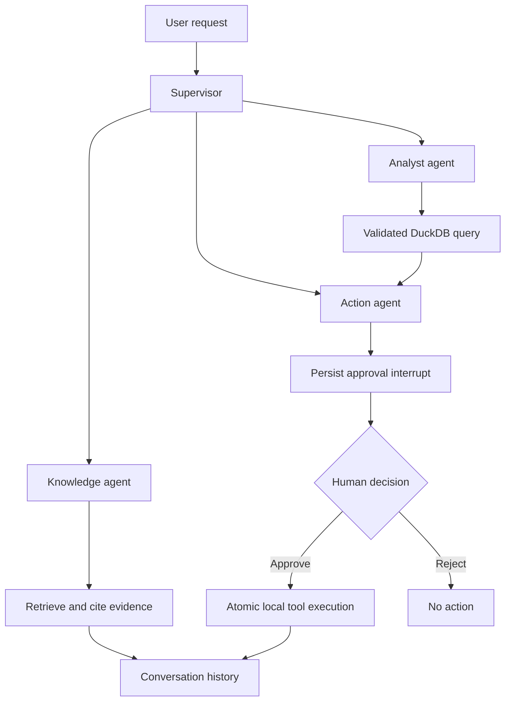

# LocalOps AI

**A local business operations assistant with evidence-backed answers, data analysis, and human-approved actions.**

Built by **Muhammad Bilal** as an inspectable AI engineering portfolio project. Upload your business documents, ask questions with citations, analyze CSV/Excel data, and review tasks or reports before they are created.

[Architecture](docs/architecture.md) · [Getting started](docs/getting-started.md) · [API guide](docs/api-reference.md) · [Testing](docs/testing-strategy.md) · [Specification coverage](docs/requirements-coverage.md)

## Start here

| Your goal | Start with |
| --- | --- |
| Try it without installing anything | The browser demo linked in the repository description / deployment notes |
| Run it with your own documents | The Docker quick start below |
| Review the engineering | `src/localops/orchestration/graph.py`, `src/localops/tools/registry.py`, and `tests/` |
| Check what has actually been verified | [Validation report](docs/validation.md) |

**Project status:** an implemented, tested local baseline with optional model integrations. This is not a claim that every item in the 88-section specification is production-certified. Live model quality, voice quality, operating-system isolation, and large-scale performance need their own validation. The [coverage matrix](docs/requirements-coverage.md) records the gaps explicitly.

## Three honest runtime modes

| Mode | Runs where | What it does | Model needed? |
| --- | --- | --- | --- |
| Browser demo | Your browser | Local text uploads, keyword excerpts, three CSV query templates, approvals, tasks, reports | No; never presented as LLM inference |
| Local extractive | Your computer | FastAPI, LangGraph, SQLite, BM25, PDF/Office extraction, validated DuckDB, persistent approvals | No |
| Local Ollama | Your computer | All local features plus generated, streamed answers using retrieved evidence | Yes; download explicitly |

Semantic retrieval and reranking can be enabled with local BGE models and embedded Qdrant. Local voice adapters use Faster-Whisper and Kokoro ONNX. They are optional dependencies; see [models and voice](docs/voice.md).

## Quick start

Install Git and Docker Desktop (or Docker Engine with Compose). Then:

```bash
git clone https://github.com/muhammadbilaldevops/Ai-Agent-Industry-Level-Project.git
cd Ai-Agent-Industry-Level-Project
docker compose up --build
```

Open **http://localhost:8000**. Open **http://localhost:8000/docs** for the API explorer. The first image build needs internet for dependencies; ordinary extractive runtime does not.

The default is **local extractive mode**, so you can upload files and verify the workflows without a GPU or model download. To load the included synthetic company files, open another terminal:

```bash
docker compose exec localops python scripts/seed_demo.py
```

Try:

1. “What is our refund policy?” — inspect the source citation.
2. “Analyze sales performance” — inspect the generated query, table, and chart.
3. “Which products need restocking?” — inspect rows below their reorder levels.
4. “Generate a sales report” — approve it, then download the report.
5. Upload your own documents and repeat with questions relevant to them.

Stop with `docker compose down`. Named volumes retain your files and conversations. Do not use `down -v` unless you intend to remove that data.

### Enable generated answers

Copy `.env.example` to `.env`, then set `LOCALOPS_MODE=ollama` and choose `LOCALOPS_MODEL`. Start the optional model service and explicitly download the configured model:

```bash
docker compose --profile ai up -d ollama
docker compose exec ollama ollama pull llama3.1:8b
docker compose --profile ai up --build -d
```

Model identifiers are configurable. Do not select Ollama cloud models. The default 8B model needs substantially more memory than extractive mode; choose a smaller local model if your hardware cannot run it. Model images and model weights are not fully pinned by digest in this release.

### Develop without Docker

Requires **Python 3.12+**, **Node.js 22**, and the pinned pnpm version from `apps/web/package.json`.

```bash
python -m venv .venv
# macOS / Linux:
source .venv/bin/activate
# Windows PowerShell instead: .venv\Scripts\Activate.ps1
python -m pip install -r requirements-dev.txt
python -m pip install --no-deps -e .
corepack enable
corepack prepare pnpm@11.25.0 --activate
cd apps/web
pnpm install --frozen-lockfile
cd ../..
node scripts/build-web.mjs
uvicorn apps.api.main:app --host 127.0.0.1 --port 8000
```

The built web app and API share one origin. You do not need to configure CORS. Run `python scripts/seed_demo.py` in another activated terminal if you want samples. See [troubleshooting](docs/getting-started.md#troubleshooting).

## How a request works



The analytics-to-action edge is used for multi-step report requests. Ordinary analysis returns directly. The model never owns approval or permission decisions.

## Repository guide

| Directory | Responsibility |
| --- | --- |
| `apps/api/` | FastAPI composition, request boundaries, and endpoint handlers |
| `apps/web/` | Next.js + TypeScript UI, Shadcn controls, browser demo, and local API adapter |
| `src/localops/agents/` | Typed state and deterministic intent routing |
| `src/localops/orchestration/` | LangGraph workflow and durable approval interrupts |
| `src/localops/rag/` | Extraction, chunking, BM25, local vectors, fusion, reranking, citations |
| `src/localops/llm/` | Local Ollama streaming, retries, health, circuit breaker |
| `src/localops/tools/` | Validated, allowlisted tasks and reports with atomic approval |
| `src/localops/security/` | File validation, workspace paths, request size limits |
| `src/localops/voice/` | Optional local STT/TTS adapters |
| `src/localops/evaluation/` | Reproducible routing and retrieval evaluation |
| `tests/` | Unit, API, integration, contract, security, and evaluation tests |
| `apps/web/tests/e2e/` | Playwright workflows and axe accessibility checks |
| `data/samples/` | Synthetic files for a reproducible recruiter walkthrough |
| `docs/` | Design, tradeoffs, validation evidence, limitations, and setup |

## Quality checks

```bash
pytest -q
ruff check src apps/api tests scripts
ruff format --check src apps/api tests scripts
mypy
python scripts/run_evaluation.py
cd apps/web
pnpm exec tsc --noEmit
pnpm exec playwright install chromium
pnpm exec playwright test
```

The E2E suite starts the local API against the built `dist/` website. Build the website first. GitHub Actions additionally runs the container build and startup check. TypeScript is strict; Python typing currently covers selected core modules, not the entire backend.

## Safety boundaries

- Single-operator local workspace; no multi-tenant authorization claims.
- No unrestricted shell, arbitrary Python, or external messaging tools.
- SQL AST allowlist, uploaded-table restriction, disabled DuckDB external access, memory/result limits, and a killable query process.
- Every task/report write requires a durable human decision; repeated decisions cannot duplicate execution.
- Retrieved text is untrusted evidence. Prompt wording is not a complete prompt-injection defense; tool permissions are enforced separately.
- No default cloud inference or telemetry. Bootstrap downloads are explicit.
- Logs record IDs and events, not full prompts. Stored conversations and documents are not encrypted at rest; protect the local machine and backups.

## Deployment

The Sites deployment is a **browser demo**, not a GPU inference server. Visitors can personalize it with supported files on their own device. The full local stack is delivered through this repository. A public full-model deployment would need a suitable server, authentication, TLS, resource quotas, and operational review.

A custom domain such as `muhammadbilalaiagent.dev` is not registered by this repository. Ownership and registrar/DNS access are needed before it can be connected. See [deployment notes](docs/deployment.md).

## Contributing

Read [CONTRIBUTING.md](CONTRIBUTING.md), run the focused tests for your change, and include evidence for any claimed improvement. Prefer useful business capabilities and measured reliability over inflated feature counts.
