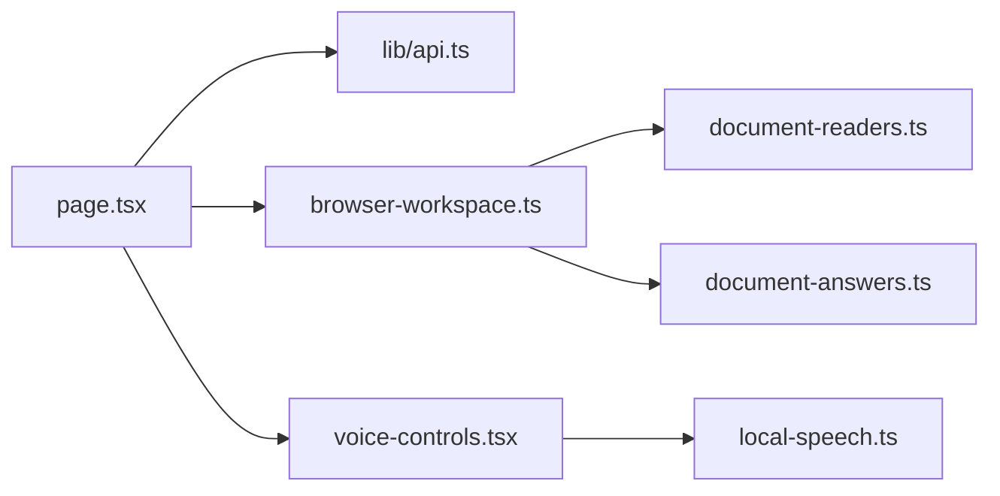

# ⚡ Frontend

The Next.js 16 / React 19 TypeScript client. `app/page.tsx` composes the chat surface, navigation, uploads, sources, suggestions, approvals, analytics, and settings. `app/globals.css` owns the responsive dark visual system. `lib/api.ts` connects to FastAPI when `NEXT_PUBLIC_API_BASE_URL` exists; otherwise `lib/browser-workspace.ts` runs locally in the browser. See [`lib/README.md`](lib/README.md).

Build with `pnpm run build`; static output is `out/`.
