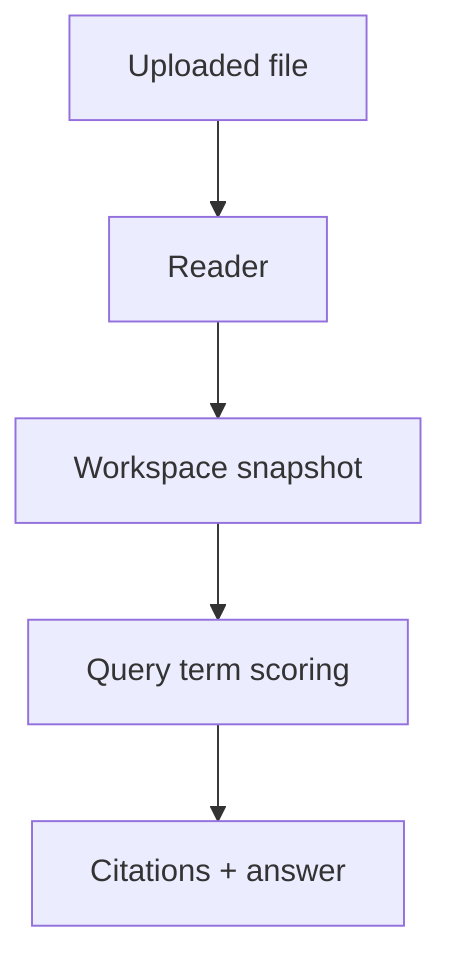

# 🧩 Frontend libraries

`browser-workspace.ts` is the browser application engine and localStorage persistence. `document-readers.ts` turns PDF/DOCX/XLSX/CSV/JSON/images into bounded text. `document-answers.ts` ranks evidence, adds citations, generates file-specific questions, and refuses unsupported claims. `local-speech.ts` decodes and resamples audio before running Whisper Tiny English through Transformers.js and ONNX WebAssembly. `api.ts` is the typed backend adapter.

