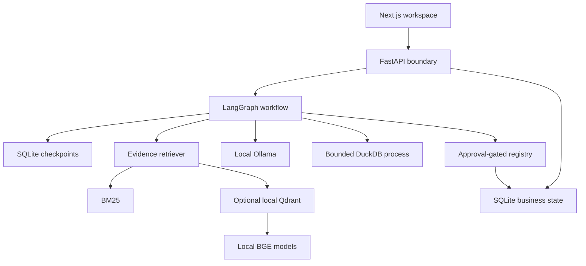

# Architecture

LocalOps AI separates the user interface, HTTP boundary, orchestration, evidence retrieval, computation, and approved side effects. Each boundary can be inspected and tested independently.

## Deployment boundary

The same static Next.js export has two adapters. `lib/demo.ts` executes deterministic browser-only operations and saves device-local state. `lib/api.ts` calls the real FastAPI application when a local runtime is detected. The public demo does not upload business data to a shared server and does not simulate LLM responses with a fake “thinking” delay.

FastAPI serves the static export and `/api/*` under one origin. In the full local application, document text, table rows, conversation history, preferences, requests, tasks, reports, and audit events live in SQLite. LangGraph checkpoints use a separate SQLite file so workflow state remains distinct from business knowledge.

## Workflow state and control

`AgentState` contains serializable values only. The supervisor chooses knowledge, analytics, action, general, or multi-step routes using auditable rules. This is intentionally deterministic routing; it is not an LLM supervisor or an autonomous planner.

Knowledge requests use retrieval and, when enabled, Ollama generation. Analytics selects a constrained recipe based on available columns. Report requests can chain analytics into the action agent. A `create_task` or `create_report` request creates a durable approval row and reaches a LangGraph `interrupt`. The API resumes that exact run with `Command(resume=...)` after a human decision.

The registry revalidates the stored payload and executes the mutation in a single SQLite `BEGIN IMMEDIATE` transaction. Request status, result, task/report, and audit event commit together. A repeated decision returns the first result rather than repeating the write. The integration suite verifies restart recovery and repeated approvals.

The agent lock serializes graph invocations within one process. This is a single-worker, single-operator design, not horizontal scaling. All graph nodes have a bounded recursion/iteration limit. SQL runs separately with a hard process deadline. Voice and document extraction need stronger process isolation before accepting hostile public workloads.

## Evidence retrieval

1. Validate extension, filename, and byte count; inspect Office archive expansion.
2. Extract text with PDF page metadata or Office/text loaders.
3. Split deterministically at paragraph, line, sentence, or word boundaries with overlap.
4. Preserve document ID, filename, page, section, chunk index, and character offset.
5. Rank with BM25 using simple plural normalization.
6. If explicitly configured, encode with cached SentenceTransformers and query local Qdrant.
7. Fuse ranked candidates with reciprocal rank fusion; optionally rerank using a cached cross-encoder.
8. Deduplicate identical context and apply a character budget.
9. Return source excerpts as citations; provide them to Ollama as untrusted evidence in model mode.

BM25 mode supports exact terms but is not semantic search. Dense similarity thresholds and character budgets are heuristics, not calibrated confidence scores. Changing an embedding model requires recreating/reindexing its vector collection; automated model-version migration is not implemented.

## Analytics

Uploaded CSV and first-sheet XLSX data are converted to bounded rows. SQL is parsed with SQLGlot and limited to a single SELECT over `dataset` with allowlisted functions. Joins, CTEs, arbitrary table functions, filesystem reads, extensions, and writes are rejected. Column values are inserted with parameters into an in-memory DuckDB database. Only column identifiers are quoted into SQL. The subprocess uses one thread, a 128 MB memory limit, a deadline, and a 500-row result limit.

The default analytics agent uses explicit templates; it does not generate arbitrary SQL from natural language. Users can enter a wider permitted SELECT subset in the Analytics view. Results are descriptive: they do not establish why sales changed.

## Security and observability

The default server binds to loopback. Optional bearer authentication is shared by the operator's workspace. Cross-origin API requests are rejected. UUIDs identify documents; user filenames are never used as database paths. No shell or arbitrary code tool exists.

JSON request logs contain request IDs, status, and elapsed time. Audit records contain event types and object references. Node trajectories accompany chat results. These are local observability primitives; an OpenTelemetry collector, distributed tracing, and an encrypted/tamper-resistant audit store are future operational work.

## Primary implementation references

- [LangGraph interrupts](https://docs.langchain.com/oss/python/langgraph/interrupts)
- [LangGraph persistence](https://docs.langchain.com/oss/python/langgraph/persistence)
- [Ollama chat API](https://docs.ollama.com/api/chat)
- [DuckDB security](https://duckdb.org/docs/stable/operations_manual/securing_duckdb/overview)

These references describe the underlying APIs. The repository tests establish what this implementation does.
