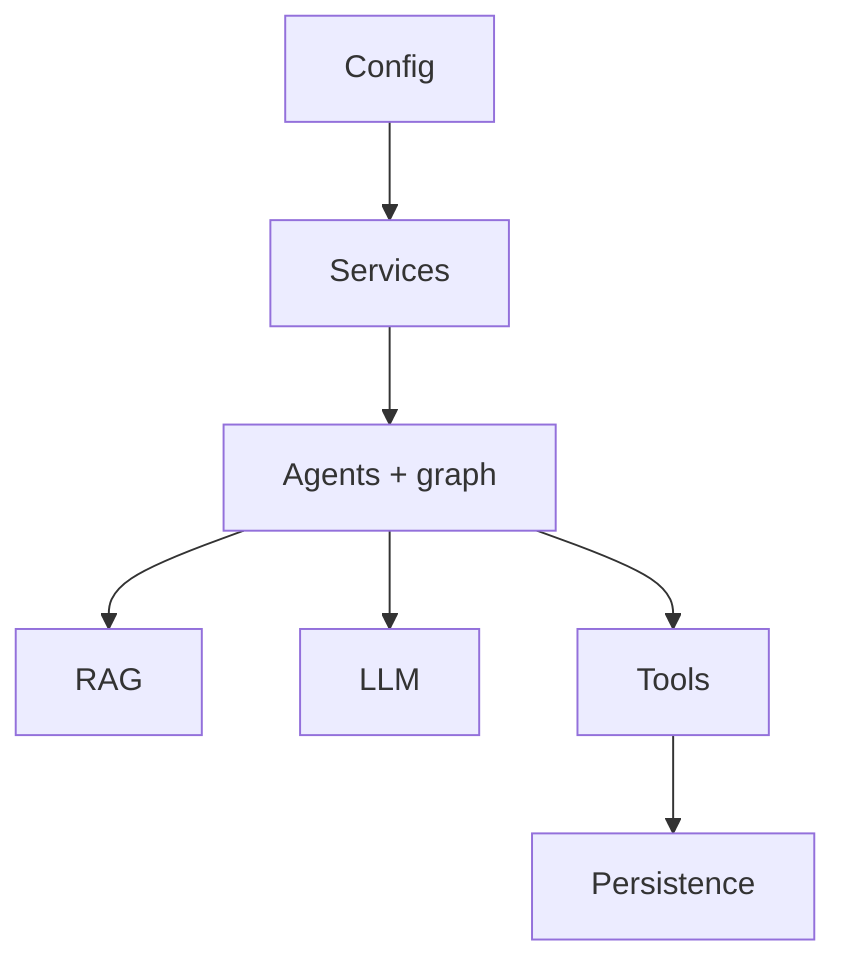

# 🧠 LocalOps domain package

This reusable Python package contains configuration, services, persistence, analytics, typed agents, orchestration, RAG, model clients, tools, security, voice, and evaluation. The API layer is intentionally thin so the same domain logic can run in local Docker or Render.

